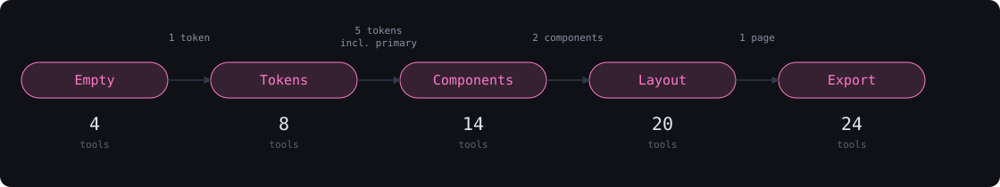

<!-- docs/hero.gif — the render moment, 1200px wide, cut from the demo. Recorded Wednesday (Turn 8 §10.2). -->

# Alternative Galaxy

**Design systems for humans and agents. The agent's tools are a function of the work's state.**

Alternative Galaxy is a design studio where a human and an AI agent build a design system on the
same page — and the agent can only do what the current state of the work allows. Tools aren't
refused; they don't exist yet. Before any tokens are defined, the agent has four tools. Once the
human sets five, it has fourteen. After a page is rendered, twenty-four, including export.

WebMCP makes this possible: the page registers tools imperatively with AbortSignals, and adds or
removes them as the human's decisions change what's legal — the same mechanism a static API can't
express. The human owns tokens, rules, and locks. The agent generates components, sketches
wireframes, and renders pages inside those constraints. Every action by either party is logged and
reversible.

The result exports as CSS variables, DTCG JSON, Tailwind config, and React components that compile.

## Why WebMCP

Static tool APIs cannot express workflow state. A design system has an order — tokens before
components, components before pages, pages before export — and an agent handed every tool at once
will skip it, because nothing tells it not to. You can write "don't generate components until tokens
exist" into a system prompt, and the agent will forget it three turns later, or argue with it, or
work around a refusal by describing the button in prose. A refusal is a negotiation. Absence is not:
a tool that does not exist cannot be called, argued with, or worked around. The agent asks what it
_can_ do, and the answer is the truth about where the work is.

WebMCP is the only protocol where the page itself is the tool provider, so the tools can be a live
function of the page's state. Alternative Galaxy registers each tool on `document.modelContext` with
an AbortSignal and diffs the registered set whenever the human's decisions move the work between
phases: aborting what is no longer legal, registering what has become legal, touching nothing else.
The browser's `toolchange` event then drives the studio's own UI — the tool count the human sees is
read back from `getTools()`, never tracked by hand. The phase system is a state machine that the
agent navigates by acting: set enough tokens and the component tools appear in your hands; delete
them and the tools leave.

This pattern is not specific to design. Any multi-step creative workflow — a legal document that
needs parties before clauses, a data pipeline that needs a schema before transforms, a game that
needs a board before moves — has states in which most actions are meaningless. Encoding those states
as tool presence rather than tool refusal is what makes an agent behave like a collaborator who
understands the work rather than a very fast intern who needs supervising. Alternative Galaxy is one
instance of it; the registration hook is 120 lines and MIT-licensed.

## How it works



Three moments carry it:

- **The gate.** The agent is asked for a button, finds no tool for it, asks the page what it can do,
  and learns what unlocks the next phase — then offers to help set the tokens.
- **The cascade.** The human drags the primary hue and every component and page recolors instantly,
  because the components are built only from CSS variables the human controls.
- **The render.** The agent sketches a landing page as gray boxes, the human approves, and the boxes
  become a fully styled page in the human's tokens.

## Try it

<https://alt.gal>

1. **ChatGPT's in-app browser.** Open the URL, then ask _"What can you do on this page?"_
   _Host verification is the Tuesday 08:00 CT test (D-041, D-199); the confirmed steps, app version,
   and OS land here before submission._
2. **Chrome 149+.** Enable `chrome://flags/#enable-webmcp-testing` and install the
   **Model Context Tool Inspector** extension. Its side panel lists the tools live and can call them.
3. **Any browser.** `@mcp-b/webmcp-polyfill` loads automatically when `document.modelContext` is
   absent, and the studio's own **Tool Inspector** (bottom status bar) lists and runs every
   registered tool. No agent required to see tools appear and disappear.

_The host used for the recorded demo is stated here once the video is cut (D-200)._

## Humans and agents

Nothing is agent-only. Every tool has a UI path; the human has verbs the agent does not.

| Human only                                            | Shared — UI path · tool path                                |
| ----------------------------------------------------- | ----------------------------------------------------------- |
| Edit tokens by direct manipulation (pickers, sliders) | Set a token · `set_token` / declarative `set_primary_color` |
| Lock and unlock tokens                                | Fill the palette from primary · `suggest_palette`           |
| Apply the first color from the declarative form       | Add or remove a rule · `add_rule` / `remove_rule`           |
| Approve a wireframe                                   | Create a component (+ Component) · `generate_component`     |
| Reorder and remove sections by hand                   | Edit a component (Edit panel) · `modify_component`          |
| Toggle light/dark, switch viewport                    | Remove a component · `remove_component`                     |
| Undo anything, by either party                        | See why it looks like this · `explain_component`            |
| Delete a page, reset the workspace                    | Copy component code · `get_component_code`                  |
| Download the export ZIP                               | Sketch a wireframe (New wireframe) · `sketch_wireframe`     |
| Use the Tool Inspector                                | Modify a layout (section controls) · `modify_layout`        |
|                                                       | Remove a wireframe (tab ✕) · `remove_wireframe`             |
|                                                       | Render a page (Render button) · `render_page`               |
|                                                       | Generate a dark theme (button) · `generate_dark_theme`      |
|                                                       | Run the audit (button) · `audit_accessibility`              |
|                                                       | Export (panel) · `export_*`                                 |

The agent is a collaborator with the same verbs and fewer nouns: no locks, no undo, no approval.

## Comparison

- **v0.** v0 turns a prompt into UI and decides the design system for you; if you want to change the
  brand color afterward, you prompt again and hope. Alternative Galaxy inverts the ownership: the
  human defines the system first, and the agent's generation tools do not exist until it's defined.
  Changing the brand color is a slider, not a regeneration.
- **Figma Make / Figma AI.** Figma's agent works inside Figma's file format for designers who will
  hand off to engineers later. Alternative Galaxy runs in the browser the agent already lives in,
  produces code as the primary artifact, and is protocol-first: it doesn't ship an agent, it ships
  tools any WebMCP client can call.
- **Banani, UX Pilot, Token Designer.** Generators with an AI button. Their agent is their agent;
  their tools aren't exposed to anything outside the product; none gate what the agent may do on
  workflow state. In Alternative Galaxy the agent is whatever the user brought, and the tool list is
  the permission system.
- **A normal MCP server.** The design surface is the browser — the human is looking at the canvas. A
  headless server would need its own state, its own rendering, and a sync channel back to the page.
  WebMCP is the only protocol where the page itself is the tool provider, so the human and the agent
  are guaranteed to be looking at the same thing.
- **Claude Design, Doop, and other same-surface canvases.** Closed products with a built-in model.
  Alternative Galaxy is open (MIT), model-agnostic, and legible: the human can see exactly which
  tools the agent has at every moment, and why.
- **mace, shipwright (fellow submissions).** Mace proved state-gating; shipwright proved a shared
  canvas. Alternative Galaxy has both, adds a second gating axis (rules, evaluated against the same
  style dictionary the components render from), and solves a problem developers complain about daily
  rather than one they encounter at a parliamentary meeting or a starship yard. Full credit to mace
  for the registration pattern; ARCHITECTURE.md names what was borrowed.

## Architecture

[ARCHITECTURE.md](ARCHITECTURE.md) covers the registration loop, why exactly one tool is
declarative, the result envelope, the phase machine, the CSS-variable cascade, token-only
components, two-axis gating, the wireframe→render pipeline, the log as history, deployment, and what
was deliberately left unused. Every section quotes the code it describes.

<!-- docs/studio.png — the three-panel studio, phase 3, captured Wednesday. -->

## Tech stack

Next.js (App Router) · React · TypeScript (strict, `noUncheckedIndexedAccess`) · Zustand ·
`webmcp-types` · `@mcp-b/webmcp-polyfill` (fallback only) · JSZip · Vitest · Playwright.

No UI framework. No CSS framework. No highlighter, no icon library, no color library.

## Development

```bash
pnpm install
pnpm dev          # http://localhost:3000
pnpm typecheck    # next typegen (pretypecheck), then tsc --noEmit
pnpm lint         # eslint + prettier --check
pnpm test         # vitest
pnpm e2e          # playwright, against the fake modelContext fixture

./scripts/verify-export.sh        # compiles the TSX this studio exports, in a scratch app
node scripts/sync-library-css.mjs # after editing src/components/library/library.css
```

`typecheck` is preceded by a `pretypecheck` script that runs `next typegen`, because `tsc` cannot
resolve the generated route types (`LayoutProps`, `PageProps`, and the `.next/types` entries
`tsconfig.json` includes) until they have been written. Running `tsc --noEmit` on a clean checkout
without it fails on types the repo never declares.

`next typegen` also rewrites `tsconfig.json` as a side effect — it sets `jsx` to `react-jsx`, adds
`.next/dev/types/**/*.ts` to `include`, and reformats every array. `tsconfig.json` is a frozen
boundary file (D-214) and none of that is wanted, so **revert it after running typegen**:

```bash
git checkout -- tsconfig.json
```

The polyfill is a dynamic import that runs only when `document.modelContext` is absent after a short
wait for an extension-injected context, so a Chrome build with the real API never loads it. The
Playwright suite installs a 20-line fake `document.modelContext` (borrowed from shipwright) and
asserts the registered set grows and shrinks with the phase.

## Credits

- [mace](https://github.com/) — diff-based registration, deferred sync, and the Chrome 151
  abort-at-registration measurement that D-004 is built on.
- [shipwright](https://github.com/) — the strict-mode hook lifecycle and the fake `modelContext`
  test fixture.
- Chrome's `webmcp-tools` repo — `webmcp-declarative.d.ts`, copied verbatim with its Apache-2.0
  header.

## License

MIT. Everything the studio exports is MIT too — the tokens, the components, and the pages are yours.
